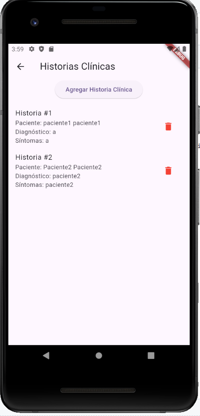
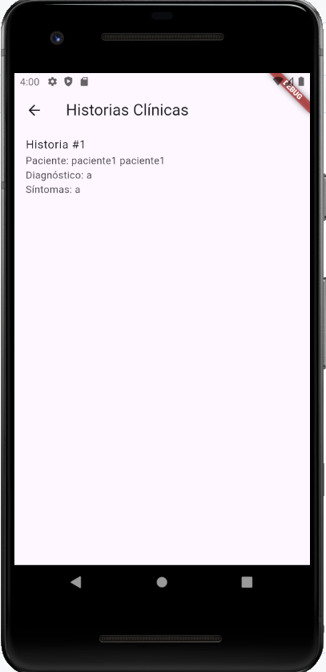
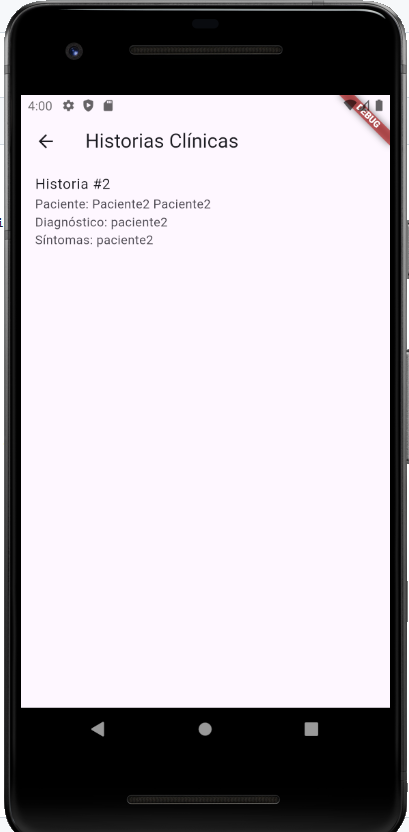
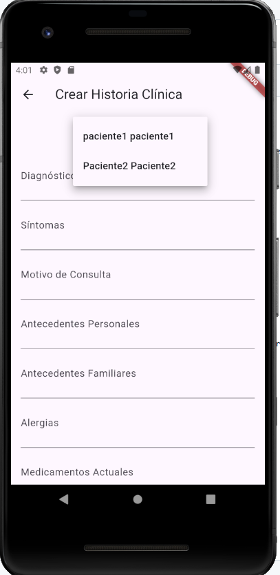
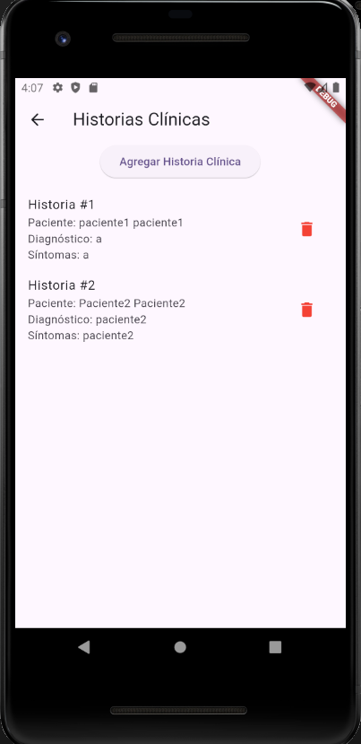

# SM2_EXAMEN_PRACTICO

El proyecto se encargara de realizar un reporte de historias clinicas por usuario para que los pacientes tengan acceso directo a sus historias de usuario de manera mas rapida y no solicitarla en persona o esperar un correo del seguro asi tiene mas informacion sobre su respectivo historial clinico

# Github 
- [Github](https://github.com/JosueUPT/SM2_EXAMEN_PRACTICO)

# Ver historia clinica
El usuario registrado podra visaulizar el historial clinico que se le asigno o creo el profesional , esto permitira al usuario paciente solamente ver sus historiales clinicas donde nadie mas tendra acceso a ver tus historias clinicas y asi el paciente tendra ams privacidad
El usuario administrador profesional podra visualizar todos los historiales clinicos por paciente

## Profesional

## Paciente 1

## Paciente 2

# Crear historia clinica
El administrador podra crear una historia clinica segun la cantidad de usuarios que tengan o se han registrado como pacientes , es decir que el administrador podra visualizar y crear las historia clinicas

# Enlaces y Referencias
- [Cupertino Icons](https://pub.dev/packages/cupertino_icons)
- [Sql Lite](https://www.sqlite.org/)

